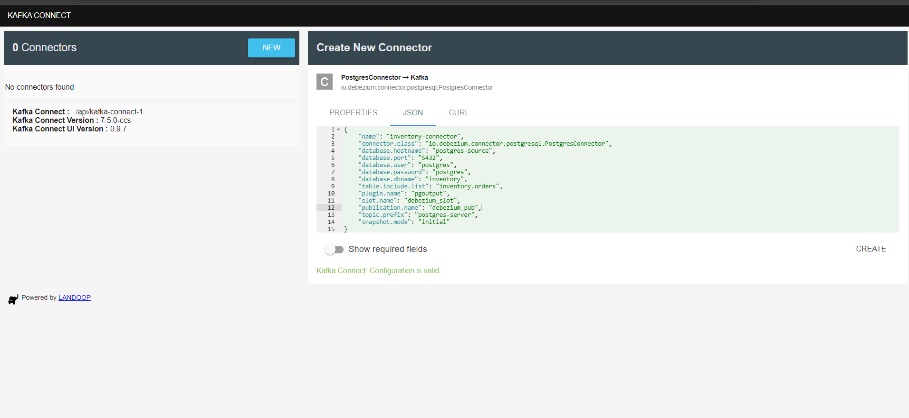

# Pipeline CDC: PostgreSQL → ClickHouse

Pipeline Change Data Capture real-time menggunakan Debezium, Kafka, dan ClickHouse dengan monitoring Grafana.


## 🚀 Quick Start

### 1. Jalankan Services
```powershell
# Clone dan jalankan semua services
git clone <url>
cd cdc-psql-clickhouse
docker compose -f docker-compose.yml up -d

# Verifikasi services berjalan
docker ps
```

### 2. Arsitektur

```
PostgreSQL WAL → Debezium → Kafka Topics → ClickHouse Kafka Engine → MergeTree Tables
      ↓            ↓           ↓               ↓                        ↓
   Postgres      Kafka      Topic           Real-time               Analytics
   Exporter     Exporter   Monitoring      Consumption             Queries
      ↓            ↓           ↓               ↓                        ↓
      └────────────┴───────────┴───────► Prometheus ◄─────────────────┘
                                              ↓
                                         Grafana Dashboards
                                      (Real-time CDC Monitoring)
```

**Alur Data:**
1. **PostgreSQL** menangkap transaksi dalam WAL
2. **Debezium** membaca WAL dan mempublikasikan ke topik Kafka
3. **ClickHouse Kafka Engine** mengkonsumsi dan mentransformasi data
4. **Grafana** menampilkan dashboard real-time

### 3. Akses Services

| Service | URL | Kredensial | Tujuan |
|---------|-----|------------|--------|
| **Grafana** | http://localhost:3000 | admin/admin | Dashboard monitoring |
| **ClickHouse** | http://localhost:8123 | default/(empty) | Database target |
| **Kafka Connect UI** | http://localhost:8001 | - | Manajemen connector |
| **Kafdrop** | http://localhost:9001 | - | Viewer topik Kafka |
| **PostgreSQL** | localhost:5432 | postgres/postgres | Database source |

### 4. Database Source Connector
Membuat database source connector bisa menggunakan kafka connect UI pada http://localhost:8001 dengan memasukan konfigurasi file [database soure connector](config/debezium-source.json)
1. klik New
2. Pilih Postgresconnector
3. Masukan konfigurasi format JSON
4. Create



### Connect Database Clickhouse menggunakan ClickHouse Kafka Engine

Membuat connection database soure (psql) dan database target (clickhouse) pada DBeaver.

#### **ClickHouse Connection**
```
Connection Name: CDC-ClickHouse-Analytics
Database Type: ClickHouse
Host: localhost
Port: 8123
Database: default
User: default
Password: (empty)
Additional Properties:
  - use_server_time_zone=true
  - socket_timeout=300000
```

#### **PostgreSQL Connection**
```
Connection Name: CDC-PostgreSQL-Source
Database Type: PostgreSQL
Host: localhost
Port: 5432
Database: inventory
User: postgres
Password: postgres
Additional Properties:
  - ssl=false
  - ApplicationName=DBeaver-CDC-Monitor
```

Menjalankan clickhouse kafka engine dengan cara running code pada [kafka engine](config/clickhouse-setup.sql)

### 5. Test Proces CDC

1. Insert data pada database source

```powershell
# pada database sourec
INSERT INTO inventory.orders (id, order_date, purchaser, quantity, product_id) 
VALUES (10008, '2016-02-22', 1001, 2, 105);
```

2. Cek pada database target apakah proses CDC sudah berjalan


3. Sudah berjalan.


### 6. Grafana UI 

🚀 Quick Access
- **URL**: http://localhost:3000
- **Default Login**: `admin` / `admin`
- **Dashboard**: "CDC Pipeline Monitoring" (auto-imported)
