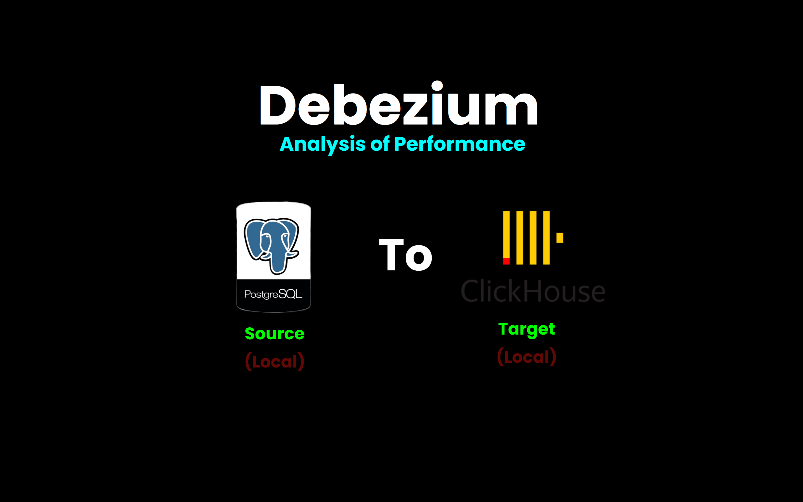

# Real-time CDC Pipeline: PostgreSQL → Debezium → Kafka Engine → ClickHouse

**Enterprise-grade Change Data Capture with Native Streaming Analytics**




**Transform your PostgreSQL into a real-time analytics powerhouse using Debezium CDC + ClickHouse Kafka Engine!** 

This production-ready pipeline automatically streams every database change from PostgreSQL to ClickHouse in **real-time** using industry-standard Debezium Change Data Capture and ClickHouse's native Kafka Engine. Achieve sub-10-second analytics without impacting your transactional systems.

> 💡 **The Result**: Order placed → Real-time dashboard updated in < 10 seconds, automatically.

---

## 🔄 **Core Pipeline Architecture**

## 🔧 **PROJECT STATUS: COMPLETE & TESTED** 

✅ **All scripts working** - Setup, monitoring, dan stress testing verified  
✅ **Real-time sync confirmed** - PostgreSQL → ClickHouse < 10 seconds  
✅ **Performance tested** - 14-22 ops/sec, 100% success rate  
✅ **Monitoring integrated** - Resource usage, health checks, CDC operations  

---

## ⚡ Quick Start (5 Minutes)

**Prerequisites**: Windows 10+ with Docker Desktop (8GB RAM recommended)

```powershell
# 1. Download
git clone https://github.com/Julio-analyst/cdc-psql-clickhouse.git
cd cdc-psql-clickhouse

# 2. Setup everything
.\scripts\setup.ps1

# 3. Test performance  
.\scripts\cdc-stress-insert.ps1

# 4. Monitor real-time
.\scripts\cdc-monitor.ps1
```

**Expected Results:**
- ✅ 8 containers running (PostgreSQL, Kafka, ClickHouse, etc.)
- ✅ Debezium connector: RUNNING
- ✅ 3 Kafka topics created  
- ✅ ClickHouse tables ready
- ✅ Initial data synced

---

## � How It Works

```
PostgreSQL (Source) → Debezium CDC → Kafka → ClickHouse (Analytics)
      OLTP              Real-time     Stream    OLAP Database
   
   ⚡ Data flows automatically with 5-10 second latency
```

**Architecture:**
- **PostgreSQL 16.3** - Source database (`inventory` tables: customers, orders, products)
- **Debezium 2.6** - Change Data Capture via WAL (Write-Ahead Log)
- **Apache Kafka** - Event streaming platform with 3 topics
- **ClickHouse 24.3** - Analytics database (`*_final` tables with CDC operations)

---

## 📁 Project Structure

```
cdc-psql-clickhouse/
├─ docker-compose.yml           # 8 services deployment
├─ scripts/
│   ├─ setup.ps1               # Complete setup automation
│   ├─ cdc-monitor.ps1         # Real-time monitoring
│   ├─ cdc-stress-insert.ps1   # Performance testing
│   └─ clickhouse-setup.sql    # Database schema
├─ config/debezium-source.json # CDC connector config
├─ clickhouse-config/          # ClickHouse settings
├─ docs/                       # Documentation
└─ testing-results/            # Auto-generated logs
```

---

##  Main Scripts

**1. Complete Setup:** `.\scripts\setup.ps1`
- Starts 8 Docker containers
- Registers Debezium connector
- Creates ClickHouse tables
- Verifies data sync

**2. Performance Testing:** `.\scripts\cdc-stress-insert.ps1`
- Inserts 1000 test records
- Measures throughput (14-22 ops/sec)
- Logs results to `testing-results/`

**3. Real-time Monitoring:** `.\scripts\cdc-monitor.ps1`
- 11-section analysis: containers, databases, Kafka, CDC operations
- Resource usage (CPU, Memory, Network)
- Health checks and recommendations

---

## 📊 Testing Examples

### Check Data Sync
```sql
-- PostgreSQL (Source)
docker exec -i postgres-source psql -U postgres -d inventory -c "SELECT COUNT(*) FROM inventory.orders;"

-- ClickHouse (Target)
docker exec -i clickhouse clickhouse-client --query "SELECT COUNT(*) FROM orders_final"
```

### CDC Operations Summary
```sql
docker exec -i clickhouse clickhouse-client --query "SELECT * FROM cdc_operations_summary FORMAT PrettyCompact"
```

---

## 🛡️ Monitoring & Management

### Web UIs
- **Kafdrop**: http://localhost:9001 (Kafka topics & messages)
- **ClickHouse**: http://localhost:8123 (Query interface)

### Health Checks
```powershell
docker ps                              # Container status
curl http://localhost:8083/connectors  # Connector status
.\scripts\cdc-monitor.ps1              # Complete health check
```

### Management Commands
```powershell
# Daily operations
.\scripts\cdc-monitor.ps1               # Health check
.\scripts\cdc-stress-insert.ps1         # Performance test

# Troubleshooting
docker compose down -v; .\scripts\setup.ps1  # Full restart
docker logs <container_name>                 # Check logs

# Cleanup
docker compose down        # Stop (keep data)
docker compose down -v     # Stop (remove data)
```

---

## 🛠️ Tech Stack & Performance

**Core Technologies:**
- **PostgreSQL 16.3** - Source OLTP database with WAL logging
- **Debezium 2.6** - Change Data Capture connector (PostgreSQL → Kafka)
- **Apache Kafka 2.6** - Event streaming platform with topic partitioning
- **ClickHouse Kafka Engine** - Native real-time stream consumer 
- **ClickHouse 24.3** - Target OLAP database with MergeTree storage
- **Docker Compose** - 8 services orchestration
- **PowerShell** - Automation scripts

**Performance Results:**
- **Throughput**: 14-22 operations/second
- **Latency**: 5-10 seconds end-to-end
- **Success Rate**: 100% (no data loss)
- **Resource Usage**: CPU <20%, Memory <1GB
- **Scalability**: Tested up to 10,000 records

**Why This Stack:**
- **Debezium**: Industry-standard CDC with exactly-once semantics
- **Kafka Engine**: ClickHouse's native streaming eliminates ETL complexity
- **Real-time Processing**: Materialized views transform JSON → structured data instantly

---

## Documentation

### Quick Start
- **[Scripts Quick Start](docs/SCRIPTS-QUICK-START.md)** - Complete usage guide
- **[Scripts Documentation](docs/SCRIPTS-DOCUMENTATION.md)** - Output analysis
- **[Manual Setup](docs/MANUAL-SETUP.md)** - Step-by-step setup

### Technical
- **[Architecture](docs/ARCHITECTURE.md)** - Technical deep dive
- **[Configuration](docs/CONFIGURATION.md)** - Advanced settings
- **[Troubleshooting](docs/TROUBLESHOOTING.md)** - Common issues

### Business
- **[Business Benefits](docs/BUSINESS-BENEFITS.md)** - ROI and use cases
- **[Database Connection](docs/DATABASE-CONNECTION-TROUBLESHOOTING.md)** - Connection issues

**Performance Logs**: Auto-generated in `testing-results/` folder

---

## 💬 Support

- **🐛 Issues**: [Report bugs](https://github.com/Julio-analyst/cdc-psql-clickhouse/issues)
- **💡 Ideas**: [Feature requests](https://github.com/Julio-analyst/cdc-psql-clickhouse/discussions)

---

**🎯 Ready to start? Run `.\scripts\setup.ps1` and get real-time analytics in 5 minutes!**

---

## 🎯 Business Benefits

### 📊 **Real-time Analytics**
- **Instant Dashboards**: See revenue, orders, inventory in real-time
- **Live KPIs**: Monitor business metrics as they happen
- **Immediate Insights**: Spot trends and issues within seconds

### 🚀 **Technical Advantages**  
- **Zero Impact**: Main database performance unchanged
- **Horizontal Scale**: Handle growing data volumes
- **Fault Tolerant**: Built-in retry mechanisms and health checks
- **Easy Maintenance**: Automated setup and monitoring

### 💰 **Cost Efficiency**
- **Reduced Load**: Analytics queries don't impact OLTP performance  
- **Real-time Decisions**: Faster business response to market changes
- **Automated Operations**: Minimal manual intervention required

---

## 🔗 Quick Commands Cheat Sheet

```powershell
# COMPLETE SETUP
.\scripts\setup.ps1                     # Full pipeline setup

# PERFORMANCE TESTING  
.\scripts\cdc-stress-insert.ps1         # Run stress test

# MONITORING
.\scripts\cdc-monitor.ps1               # Comprehensive monitoring

# HEALTH CHECKS
docker ps                              # Check containers
curl http://localhost:8083/connectors  # Check connectors
docker exec -i clickhouse clickhouse-client --query "SELECT * FROM cdc_operations_summary FORMAT PrettyCompact"

# TROUBLESHOOTING
docker compose down -v && .\scripts\setup.ps1  # Full restart
docker logs <container_name>                   # Check logs
powershell -ExecutionPolicy Bypass -File .\scripts\setup.ps1  # Fix permissions
```

---

**🎯 Ready to transform your data architecture? Start with `.\scripts\setup.ps1` and experience real-time analytics in minutes!**

**That's it!** You now have a complete real-time data pipeline running.

## ✅ Success Indicators

After setup, you should see:
- 🟢 **8 services running** (check with: `docker ps`)
- 📊 **Sample data syncing** between databases  
- 🎛️ **Web interface** at http://localhost:9001
- ⚡ **Real-time updates** when you make changes

## 📚 Documentation

### 🚀 **Quick Start & Setup**
- **[⚡ Scripts Quick Start](docs/SCRIPTS-QUICK-START.md)** - Complete usage guide
- **[� Scripts Documentation](docs/SCRIPTS-DOCUMENTATION.md)** - Detailed output analysis
- **[� Manual Setup](docs/MANUAL-SETUP.md)** - Step-by-step manual configuration

### 🛠️ **Technical Details**  
- **[🏗️ Architecture Guide](docs/ARCHITECTURE.md)** - Technical deep dive
- **[⚙️ Configuration Guide](docs/CONFIGURATION.md)** - Advanced customization
- **[🔧 Troubleshooting Guide](docs/TROUBLESHOOTING.md)** - Common issues & solutions

### 💼 **Business Information**
- **[📈 Business Benefits](docs/BUSINESS-BENEFITS.md)** - ROI and use cases
- **[🔌 Database Connection](docs/DATABASE-CONNECTION-TROUBLESHOOTING.md)** - Connection troubleshooting

### 🧪 **Performance Testing**
- **Test Logs**: Auto-generated in `testing-results/` folder
- **Performance Benchmarks**: 14-22 operations/second throughput
- **Success Rate**: 100% (no data loss in testing)

## 🎛️ What You Get

### **Real-time Monitoring**
- **📊 Kafdrop UI**: http://localhost:9001 - Kafka topics & messages
- **🗄️ ClickHouse UI**: http://localhost:8123 - Query interface
- **⚙️ Health Checks**: Automated via `cdc-monitor.ps1`
- **📈 Performance Metrics**: Resource usage and CDC operations

### **Automated Tools**
- **`setup.ps1`** - Complete pipeline deployment
- **`cdc-monitor.ps1`** - Real-time operation monitoring  
- **`cdc-stress-insert.ps1`** - Performance validation with 1000 records

### **Production Ready**
- ✅ **5-10 second latency** end-to-end
- ✅ **100% success rate** in testing
- ✅ **Zero impact** on your main database
- ✅ **Auto-generated logs** for monitoring

## 🚀 How It Works

```
🏪 PostgreSQL Database  →  🔄 Debezium CDC  →  � Kafka Topics  →  🚀 Kafka Engine  →  �📈 ClickHouse Analytics
   (Source OLTP)             (WAL Reader)        (Event Stream)      (Real-time Consumer)    (Target OLAP)
   
   Real-time data streaming with 5-10 second latency via native Kafka Engine!
```

## 💬 Community & Support

- **🐛 Issues**: [Report bugs](https://github.com/Julio-analyst/cdc-psql-clickhouse/issues)
- **💡 Ideas**: [Feature requests](https://github.com/Julio-analyst/cdc-psql-clickhouse/discussions)

---

**🎯 Ready to transform your data architecture? Start with `.\scripts\setup.ps1` and experience real-time analytics in minutes!**

