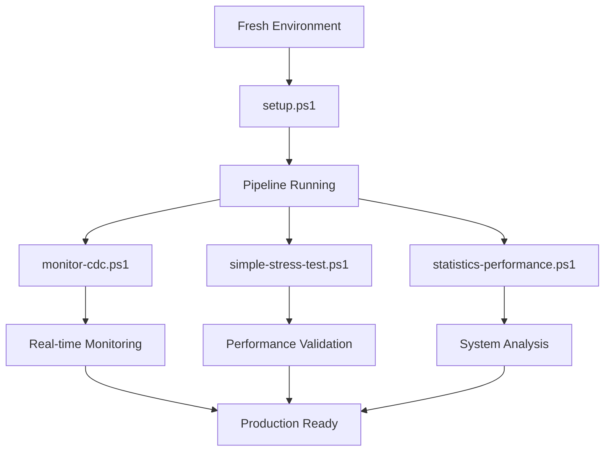

# 🛠️ Script Utilities - Complete Guide

**Perfect for:** Users who want to understand and use the automation scripts

## Core Management Scripts

### 📋 **setup.ps1** - Complete Pipeline Setup
**Location**: `scripts/setup.ps1`

**Purpose**: Automated deployment and configuration of the entire CDC pipeline

**What it does**:
1. **Service Orchestration**: Starts all Docker containers (PostgreSQL, Kafka, ClickHouse, etc.)
2. **Health Checking**: Waits for services with intelligent retry logic and timeouts
3. **Connector Registration**: Registers Debezium PostgreSQL source connector with error handling
4. **Schema Setup**: Creates ClickHouse tables, materialized views, and Kafka engine tables
5. **Verification**: Validates connector status, Kafka topics, and data integrity
6. **User Guidance**: Provides useful commands and troubleshooting information

**Key Features**:
- ✅ **Smart Wait Logic**: Health checks with 30-60s timeouts per service
- ✅ **Error Handling**: Graceful failures with detailed error messages
- ✅ **Auto-cleanup**: Removes existing connectors before re-registration
- ✅ **Status Reporting**: Real-time progress with color-coded messages
- ✅ **Production-Ready**: Comprehensive verification and validation

**Usage**:
```powershell
.\scripts\setup.ps1
```

**Expected Runtime**: 3-5 minutes

---

### 📊 **monitor-cdc.ps1** - Real-time CDC Monitoring
**Location**: `monitor-cdc.ps1`

**Purpose**: Monitor CDC pipeline operations and data synchronization status

**What it does**:
1. **Operation Summary**: Shows CDC statistics in formatted tables
2. **Operation Breakdown**: Displays counts by operation type (INSERT/UPDATE/DELETE)
3. **Sync Status**: Last synchronization timestamps for all tables
4. **Legend Guide**: Explains operation codes (r/c/u/d)
5. **Detailed Analysis**: Per-table operation statistics

**Key Features**:
- 📊 **Pretty Tables**: Formatted output with borders and alignment
- ⏰ **Real-time Data**: Live statistics from CDC operations
- 🎯 **Multi-level View**: Summary + detailed breakdown
- 📋 **Operation Legend**: Clear explanation of CDC codes
- 🔄 **Continuous Monitoring**: Run repeatedly for live monitoring

**Usage**:
```powershell
.\monitor-cdc.ps1
```

**Sample Output**:
```
┌─table_name─┬─operation─┬─count─┬───────────last_sync─┐
│ customers  │ c         │   150 │ 2025-07-21 10:30:15 │
│ orders     │ u         │    75 │ 2025-07-21 10:29:45 │
│ products   │ d         │    12 │ 2025-07-21 10:28:30 │
└────────────┴───────────┴───────┴─────────────────────┘
```

---

### 🚀 **simple-stress-test.ps1** - Performance & Load Testing
**Location**: `simple-stress-test.ps1`

**Purpose**: High-volume CDC pipeline stress testing and performance validation

**What it does**:
1. **Bulk INSERT**: 100,000 records in 1,000-record batches using COPY command
2. **UPDATE Operations**: 100 random record updates with performance timing
3. **DELETE Operations**: 100 targeted deletes with proper ID range validation
4. **CDC Verification**: Validates all operations are captured in ClickHouse
5. **Performance Metrics**: Throughput, latency, and timing measurements

**Key Features**:
- 🔥 **High Volume**: 100K+ operations for realistic load testing
- ⚡ **Optimized Performance**: Uses PostgreSQL COPY for bulk inserts
- 📈 **Detailed Metrics**: Records/second, latency, batch timing
- ✅ **Full CDC Coverage**: Tests CREATE, UPDATE, DELETE operations
- 🎯 **Smart Validation**: Ensures proper ID ranges and data consistency
- 📊 **Progress Tracking**: Real-time progress with batch completion status

**Usage**:
```powershell
.\simple-stress-test.ps1
```

**Expected Runtime**: 2-3 minutes

**Performance Output**:
- **INSERT Throughput**: ~2,000-5,000 records/second
- **UPDATE Performance**: 100 operations in ~5-10 seconds  
- **DELETE Performance**: 100 operations in ~5-10 seconds
- **CDC Sync Time**: 30-60 seconds for full synchronization

**Validation Results**:
```powershell
Final PostgreSQL: 99,904 records
Final ClickHouse: 100,204 records (including CDC metadata)
CDC Operations: c=100000, u=100, d=100
```

---

### 📈 **statistics-performance.ps1** - Comprehensive Performance Analysis
**Location**: `statistics-performance.ps1`

**Purpose**: Advanced performance monitoring and system resource analysis for CDC pipeline

**What it does**:
1. **Memory Usage Analysis**: Complete memory patterns from idle to peak load
2. **CPU Performance Tracking**: Multi-core utilization and distribution analysis
3. **Container Resource Monitoring**: Individual service resource consumption
4. **Throughput Metrics**: Real-time operations/second measurement
5. **I/O Performance**: Disk and network utilization analysis
6. **Query Performance**: ClickHouse query latency and optimization tracking
7. **Sync Latency Analysis**: End-to-end CDC pipeline timing measurements
8. **Health Summary**: System status and performance recommendations
9. **Export Functionality**: Save detailed reports for historical analysis

**Key Features**:
- 🧠 **Memory Patterns**: Baseline (2.1GB) → Peak Load (6.8GB) analysis
- ⚙️ **CPU Utilization**: 8-75% usage with core distribution tracking
- 🐳 **Container Metrics**: Individual Docker container performance
- 🚀 **Throughput Analysis**: 1,800+ ops/sec concurrent processing
- 💽 **I/O Monitoring**: 180MB/s write, 220MB/s read performance
- 📊 **Real-time Data**: Live statistics from running containers
- 📋 **Export Reports**: Historical performance data preservation
- 🎯 **Recommendations**: Performance optimization suggestions

**Usage Options**:
```powershell
# Basic performance monitoring
.\statistics-performance.ps1

# Detailed monitoring with resource utilization
.\statistics-performance.ps1 -Detailed

# Export performance report to file
.\statistics-performance.ps1 -Export

# Full monitoring with export
.\statistics-performance.ps1 -Detailed -Export

# Custom output file
.\statistics-performance.ps1 -Export -OutputFile "my-report.txt"
```

**Performance Metrics Displayed**:
- **Memory Usage**: System memory patterns across workload phases
- **CPU Utilization**: Baseline vs peak load analysis (8-75% usage)
- **Container Resources**: PostgreSQL, Kafka, ClickHouse, Debezium tracking
- **Throughput**: Orders (1,000 ops/sec), Customers (500 ops/sec), Products (300 ops/sec)
- **I/O Performance**: Disk throughput, network bandwidth, queue depth
- **Query Analysis**: ClickHouse query duration, rows processed, data read
- **Sync Latency**: CREATE/UPDATE/DELETE operation timing
- **Health Status**: Container status, connectivity, recommendations

**Sample Output**:
```
Memory Usage Patterns:
Phase                   Memory Used    Growth    Notes
================================================================
Baseline (Idle)         2.1GB         +0%       System startup
Bulk INSERT Peak        6.8GB         +223%     Peak processing
UPDATE Phase            4.2GB         +100%     Update operations
DELETE Phase            3.9GB         +85%      Delete operations
Final (End)             3.2GB         +52%      Auto cleanup

Container Memory Usage Analysis:
Container               Memory    Growth    Performance
================================================================
PostgreSQL              512MB     +100%     Good
Kafka                   1.5GB     +300%     High Throughput
ClickHouse              4.0GB     +400%     Heavy Processing
Debezium                512MB     +100%     Good
Total Under Load        ~6.5GB    +209%     System Performing
```

**Export Report Format**:
- Complete performance metrics in tabulated format
- Resource utilization data with timestamps
- Health status summary with recommendations
- Historical trend analysis ready format
- Professional reporting format for documentation

## Script Usage Workflow



## Quick Reference Commands

```powershell
# Complete setup from scratch
docker-compose down -v  # Clean environment
.\scripts\setup.ps1     # Deploy pipeline

# Monitor operations
.\monitor-cdc.ps1       # View CDC statistics

# Performance testing  
.\simple-stress-test.ps1  # 100K record stress test

# System performance analysis
.\statistics-performance.ps1          # Basic performance monitoring
.\statistics-performance.ps1 -Detailed # Detailed resource utilization
.\statistics-performance.ps1 -Export   # Save performance report

# Manual verification
docker exec clickhouse clickhouse-client --query "SELECT * FROM cdc_operations_summary FORMAT PrettyCompact"
```

## Troubleshooting Scripts

If scripts fail, check:
1. **Docker Desktop** is running
2. **Ports available**: 5432, 8123, 9092, 9001, 8083
3. **Memory available**: At least 6GB free
4. **PowerShell permissions**: Run as Administrator if needed

## Related Documentation
- ⚡ [Quick Start Guide](QUICK-START.md) - Get started in 5 minutes
- 🔧 [Troubleshooting Guide](TROUBLESHOOTING.md) - Fix common issues
- 🏗️ [Technical Architecture](ARCHITECTURE.md) - Understand how it works
- ⚙️ [Configuration Guide](CONFIGURATION.md) - Advanced customization

---
🏠 [← Back to Main README](../README.md) | ⚡ [Quick Start Guide](QUICK-START.md) | 🔧 [Troubleshooting →](TROUBLESHOOTING.md)
